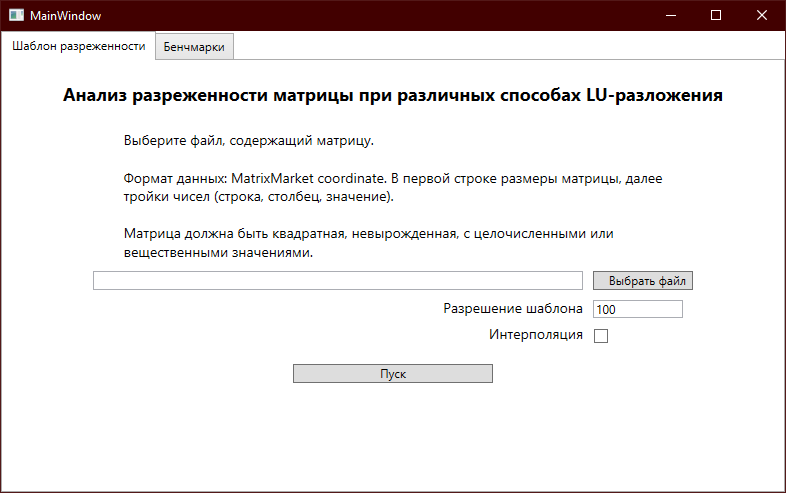
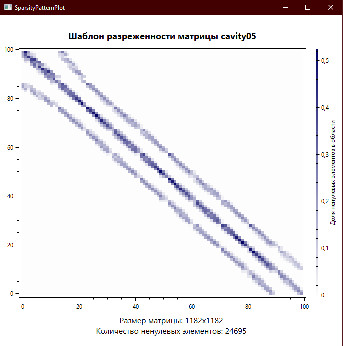
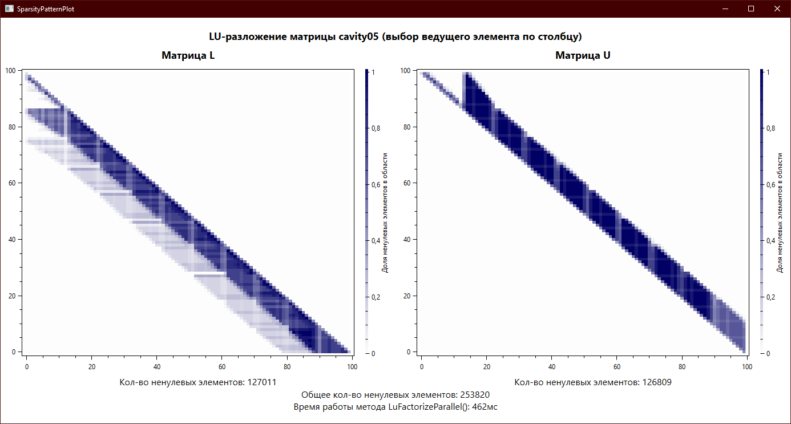
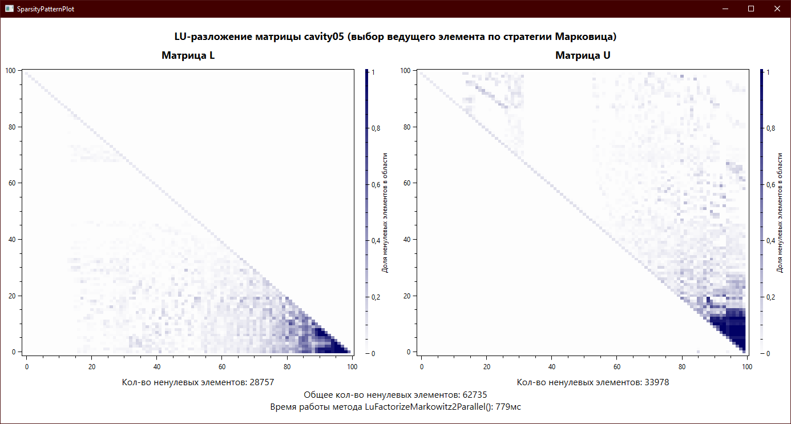
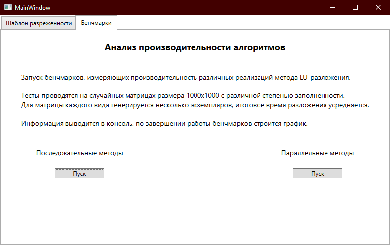
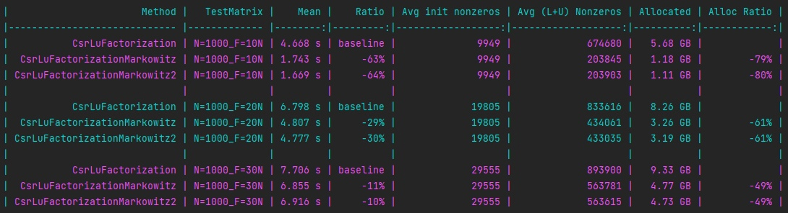
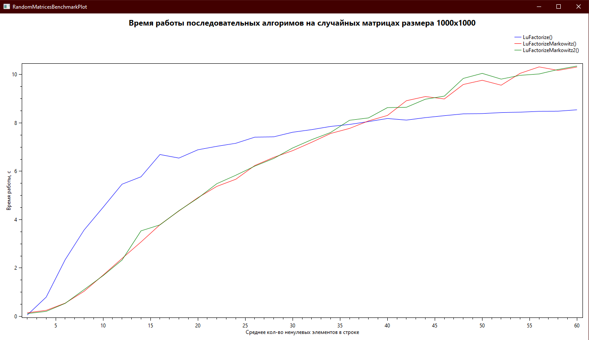
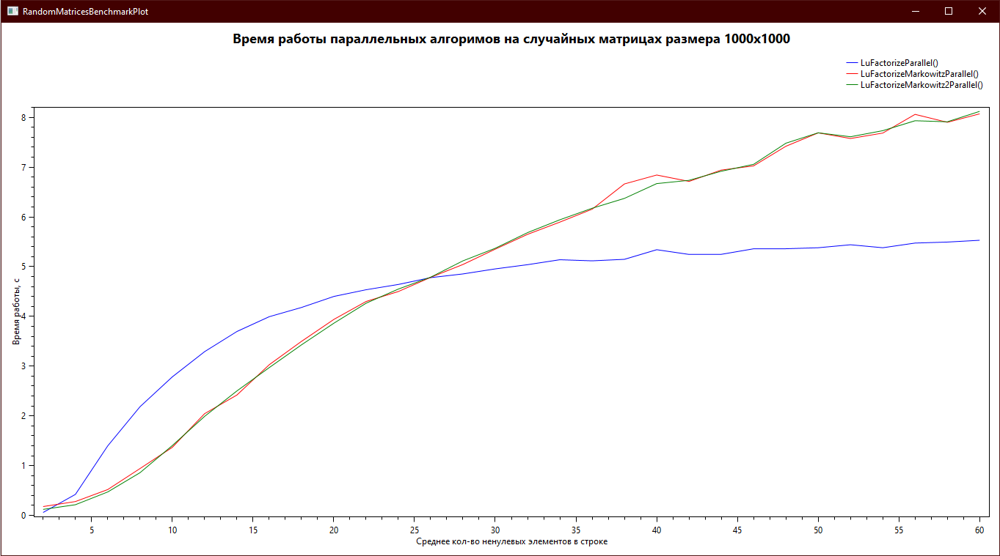

# SparseLU.NET

## Описание
**SparseLU.NET** - это проект, созданный для работы с разреженными матрицами на платформе *.NET*, а также для анализа эффективности различных реализаций метода LU-разложения для разреженных матриц.
Большая часть кода задокументирована, основное внимание уделено алгоритмам LU-разложения.

## Структура проекта
## [examples/](examples/)
### Example
Консольное приложение, содержащее примеры работы с библиотекой `SparseMatrixAlgebra`.

## [tests/](tests/)
### SparseMatrixAlgebra.UnitTests
Юнит-тесты для методов LU-разложения. Проверка проводится путем поэлементного сравнения произведения $P^{-1}LUQ^{-1}$ и исходной матрицы $A$.
Для тестирования используется среда [`NUnit`](https://nunit.org/).

### SparseMatrixAlgebra.Benchmarks
Содержит бенчмарки, измеряющие производительность алгоритмов LU-разложения на случайных матрицах и некоторых матрицах из коллекции [`SuiteSparse`](https://sparse.tamu.edu/).
Для сравнения также добавлены бенчмарки методов LU-разложения, реализованных в библиотеке [`Math.NET Numerics`](https://numerics.mathdotnet.com/). 
Тестирование проводится с использованием фреймворка [`BenchmarkDotNet`](https://benchmarkdotnet.org/).

## [src/](src/)
### SparseMatrixAlgebra
Библиотека, содержащая классы и методы для работы с разреженными матрицами. Хранение разреженных матриц осуществляется в формате *CSR*.
LU-разложение реализовано в нескольких вариациях:
- ***LuFactorize()*** - разложение с выбором ведущего элемента по столбцу.
- ***LuFactorizeMarkowitz()*** - разложение с выбором ведущего элемента по стратегии Марковица.
- ***LuFactorizeMarkowitz2()*** - разложение с выбором ведущего элемента по стратегии Марковица. Версия с отложенной перестановкой столбцов.

Соответствующие методы, где этап вычитания строк матрицы распараллелен:
- ***LuFactorizeParallel()***
- ***LuFactorizeMarkowitzParallel()***
- ***LuFactorizeMarkowitz2Parallel()***

Файл [`Settings.cs`](src/SparseMatrixAlgebra/Common/Settings.cs) содержит настройки проекта. Переменная `eps` - точность вычислений, может изменяться динамически.
Значения, меньшие либо равные `eps`, будут считаться нулем и, соответственно, не будут храниться в объекте матрицы.
Глобальные псевдонимы типов `stype` и `vtype` используются для индексации и хранения значений элементов матрицы соответственно.
При желании их можно изменить и пересобрать проект.

Версия платформы: *.NET 7.0*  
Версия языка: *C# 11.0*

### SparseMatrixAnalysis
Оконное приложение на платформе `WPF`, включающее инструменты для анализа методов LU-разложения.
Все графики строятся с помощью библиотеки [`OxyPlot`](https://oxyplot.github.io/).

**Анализ разреженности матрицы:**  

**Анализ производительности алгоритмов:**

